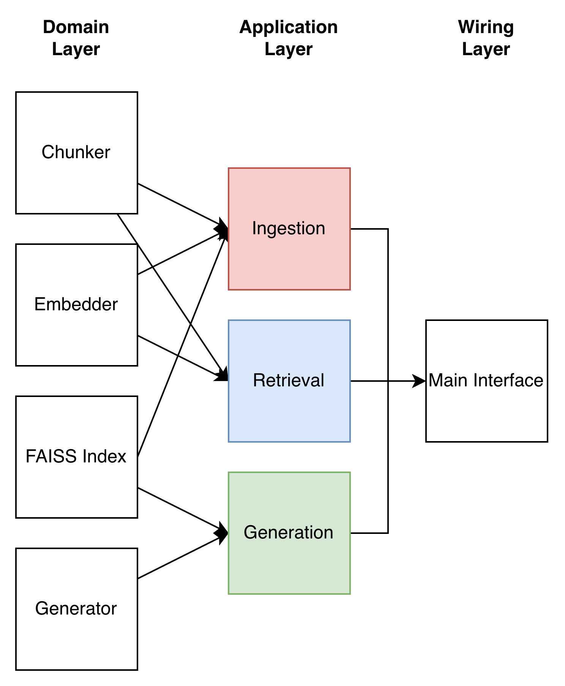

# Document RAG System

A minimal RAG (Retrieval-Augmented Generation) system built with DIP (Dependency Inversion Principle) for clean architecture and easy ablation studies on chunking/retrieval strategies.

## Overview

Also for fun, I was recently looking into DIP (Dependency Inversion Principle), so I wanted to use this as a sort of test bench to see how well that would work for this project. Overall, from what I understand we need a pipeline that looks like
```
interfaces (Abstract classes)  ← domain (embedding, chunking, DB)
     ↑                             ↑
application (ingestion, retrieval, generation)
     ↑
wiring / main
```
So more concrete diagram can be seen as,


Here `application` only depends on interfaces and domain. Following this I'll try to build out the whole pipeline and hopefully have a clean ablation on the chunking/retrieval strategy later down the line.

## Quick Start

```bash
# Install dependencies
pip install -r requirements.txt

# Ingest documents (first time only)
python main.py --ingest_first

# Run interactive mode
python main.py
```

Then type your questions in the terminal. Type 'quit' or 'q' to exit.

## Architecture

### Interface Layer
Abstract classes defining contracts for the system. Everything depends on these interfaces rather than concrete implementations.

### Domain Layer
Core implementations:
- **Chunking** (`chunk.py`): Sentence-based chunking using spaCy
- **Embedding** (`embed.py`): Sentence transformers for text embeddings
- **Vector DB** (`faiss_vdb.py`): FAISS for similarity search. For convenience I'm sticking to FAISS, but still follow DIP with an abstraction layer on top
- **Generation** (`generate.py`): HuggingFace models for response generation

### Application Layer
High-level orchestration services:
- **Ingestion** (`ingestion.py`): Ingests documents, chunks them, generates embeddings, stores in vector DB
- **Retrieval** (`retreival.py`): Embeds queries and retrieves relevant chunks
- **Generation** (`generation.py`): Combines retrieved context with LLM to generate responses

## Usage

### Basic
```bash
python main.py --ingest_first  # First time setup
python main.py                 # Run interactive mode
```

### With Options
```bash
python main.py --sens_per_chunk 2 --top_k 5 --max_tokens 512
```

### Available Arguments
- `--ingest_first`: Ingest documents before starting
- `--sens_per_chunk`: Sentences per chunk (default: 1)
- `--data_path`: Path to documents (default: dataset/Farmers_Bulletin)
- `--vector_db_path`: Path to save/load vector DB (default: dataset/vectordb)
- `--top_k`: Number of chunks to retrieve (default: 3)
- `--max_tokens`: Max tokens for generation (default: 256)
- `--temperature`: Generation temperature (default: 0.7)
- `--model_name`: HuggingFace model (default: TinyLlama/TinyLlama-1.1B-Chat-v1.0)
- `--embedder_name`: Embedder model (default: all-MiniLM-L6-v2)

## Testing

If you're curious about how to use each component independently you can take a look at the files I used to test each chunk separately in `tests/test_*`.

The overall flow is like
```
test_chunker.py -> test_embedder.py -> test_ingest.py -> test_retreival.py -> test_rag.py
```

This essentially outlines every step taken on the way to making the whole repository and how I broke down the components.
